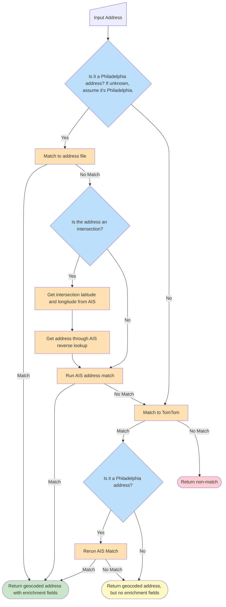

# address-batch-geocoder
A tool to standardize and geocode Philadelphia addresses. Four geocode fields are returned: `geocode_lat` and `geocode_lon` are in the EPSG:4326 coordinate system, and `geocode_x` and `geocode_y` are in the EPSG:2272 coordinate system.

## 1. Setup
You will need the following things:
1. An addresses file, provided to you by CityGeo. 
2. An AIS API key, provided to you by CityGeo.
3. Python installed on your computer, at least version 3.9

To download, use git:
```
git clone git@github.com:CityOfPhiladelphia/address-batch-geocoder.git
```
If you have not set up authentication with git on your machine before, reference this [guidance on GitHub](https://docs.github.com/en/authentication/connecting-to-github-with-ssh/generating-a-new-ssh-key-and-adding-it-to-the-ssh-agent).

Alternatively, you can download the repository as a zip file using GitHub's web interface.

Next, navigate to the project's directory and create a virtual environment:
```
python -m venv .venv
```

Then, activate the virtual environment. This will need to be activated
every time you want to run the enrichment tool, not just this once:
```
source .venv/bin/activate
```

Finally, install the packages in requirements.text:
```
pip install -r requirements.txt
```

Once you have installed everything, it is time to fill in the config file.

## 2. How to Use Address Geocoder
Address Geocoder takes an input file containing addresses 
and adds latitude and longitude to those addresses, as well as any optional
fields that the user supplies.

In order to run `Address Geocoder`, first set up the configuration file. By default,
`Address Geocoder` searchers for a file named `config.yml`. This is the recommended config filename. You can copy the template in
`config_example.yml` to a file named `config.yml` and continue from there. Detailed steps for filling out the config file are in the next section.

Then, run:

```
python3 geocoder.py
```

The dialogue will ask you to specify a config file. Hit enter without typing anything to
keep the default config file ('./config.yml')

### Configuration
1. Copy `config_example.yml` to `config.yml` by running in the terminal:
```
cp config_example.yml config.yml
```
2. Add your AIS API Key here:

```
AIS_API_KEY:
```
3. Add the filepath for the input file (the file that you wish to enrich), and the geography file (the address file you have been given.) This should look something like this:
```
input_file: ./data/example_input_4.csv
geography_file: ./data/addresses.parquet
```
4. Map the address fields to the name of the fields in the csv that you wish
to process. If you have one combined address field, map it to full_address_field.
Otherwise, leave full_address_field blank and map column names to street, city, state, and zip. Street must be included,
while the others are optional.

Example, for a csv with the following fields:
`addr_st, addr_city, addr_zip`

```
input_file: 'example.csv'

full_address_field:

address_fields:
  street: addr_st
  city: addr_city
  state:
  zip: addr_zip
```
5. List which fields other than latitude and longitude you want to add.
(Latitude and longitude will always be added.) If you enter an invalid field, the program will error out and ask you to try again. Enrichment fields will only be populated for Philadelphia addresses that match to the address file, or are geocoded by the AIS API.
A complete list of valid fields can be found further down in this README. 

```
enrichment_fields:
  - census_tract_2020
  - census_block_group_2020
  - census_block_2020
```

6. List which SRIDs should be returned. SRID refers to the format of the coordinate system. There are two options: 4326 and 2272. 4326 is the WGS84 standard, and will be output as `geocode_lat` and `geocode_lon` and 2272 Southern Pennsylvania Projection and is output as `geocode_x` and `geocode_y`. 

```
# Which SRIDs to return for geocoding
srid_4326: true
srid_2272: true
```

The full config file should look something like this:
```
# Connection Credentials
AIS_API_KEY: YOUR_API_KEY

# File Config
input_file: ./data/example_input_4.csv
geography_file: ./data/addresses.parquet

full_address_field: address

# OR, IF ADDRESS IS SPLIT INTO MULTIPLE COLUMNS:
address_fields:
  street:
  city:
  state:
  zip:

# Enrichment Fields -- Aside from coordinates, what fields to add
enrichment_fields:
  - census_tract_2020
  - census_block_group_2020
  - census_block_2020


# Which SRIDs to return for geocoding
srid_4326: true
srid_2272: true
``` 

7. You're now ready to run the geocoder:

```
python3 geocoder.py
```

The dialogue will ask you to specify a config file. Hit enter without typing anything to
keep the default config file ('./config.yml')

The output file will be saved in the same location as your input file, with _enriched attached to the filename.

## How The Geocoder Works
`Address-Batch-Geocoder` processes a csv file with addresses, and geolocates those
addresses using the following steps:

1. Takes an input file of addresses, and standardizes those 
addresses using `passyunk`, Philadelphia's address standardization system.
2. Compares the standardized data to a local parquet file, `addresses.parquet`,
and adds the user-specified fields as well as latitude and longitude from that file
3. Not all records will match to the address file. For those records that do not match,
`Address-Batch-Geocoder` queries the Address Information System (AIS) API and adds returned fields.
Please note that this process can take some time, so processing large files with a messy address field
is not recommended. As an example, if you have a file that needs 1,000 rows to be sent to AIS, this will take
approximately 3-4 minutes.
4. Records that don't match to the AIS API are then queried against TomTom, which has different address parsing
capabilities and is also able to return 
5. Records that successfully match to TomTom are then rerun against AIS to try to recover enrichment fields, if those addresses are in philly
6. The enriched file is then saved to the same directory as the input file.


The release executable of the address geocoder automatically checks an s3 bucket for an updated version of the address file. The address file is published to s3 via airflow, using this DAG configuration: https://github.com/CityOfPhiladelphia/databridge-airflow-v2-configs/blob/main/citygeo/address_service_area_summary_public.yml.

## Testing
This package uses the pytest module to conduct unit tests. Tests are
located in the `tests/` folder.

In order to run all tests, for example:
```
python3 pytest tests/
```

To run tests from one file:
```
python3 pytest tests/test_parser.py
```

To run one test within a file:
```
python3 pytest tests/test_parser.py::test_parse_address#
```

## Publishing a Release
This code is intended to be called using an executable file generated from
`powershell/geocoder_for_exe.ps1`. If changes are made to this file, we need to
make a new release.

To create a release, make sure the commit is tagged with a version number like `v1.0.0`:
```
bash# When you're ready to create a release:
git tag v1.0.0
git push origin v1.0.0
```

## Enrichment Fields
Note that if any of the fields in the input file have the same name as
an enrichment field, the incoming input file field will be renamed to have the _left suffix.
Enrichment fields will only be populated for Philadelphia addresses that match to the address file, or are geocoded by the AIS API.

| `Field` |
| --- |
|`address_high`|
|`address_low_frac`|
|`address_low_suffix`|
|`address_low`|
|`bin`|
|`census_block_2010`|
|`census_block_2020`|
|`census_block_group_2010`|
|`census_block_group_2020`|
|`census_tract_2010`|
|`census_tract_2020`|
|`center_city_district`|
|`clean_philly_block_captain`|
|`commercial_corridor`|
|`council_district_2016`|
|`council_district_2024`|
|`cua_zone`|
|`dor_parcel_id`|
|`eclipse_location_id`|
|`elementary_school`|
|`engine_local`|
|`high_school`|
|`highway_district`|
|`highway_section`|
|`highway_subsection`|
|`historic_district`|
|`historic_site`|
|`historic_street`|
|`ladder_local`|
|`lane_closure`|
|`leaf_collection_area`|
|`li_address_key`|
|`li_district`|
|`major_phila_watershed`|
|`middle_school`|
|`neighborhood_advisory_committee`|
|`philly_rising_area`|
|`planning_district`|
|`police_district`|
|`police_division`|
|`police_service_area`|
|`political_division`|
|`political_ward`|
|`ppr_friends`|
|`pwd_center_city_district`|
|`pwd_maint_district`|
|`pwd_parcel_id`|
|`pwd_pressure_district`|
|`pwd_treatment_plant`|
|`pwd_water_plate`|
|`recycling_diversion_rate`|
|`rubbish_recycle_day`|
|`sanitation_area`|
|`sanitation_convenience_center`|
|`sanitation_district`|
|`seg_id`|
|`state_house_rep_2012`|
|`state_house_rep_2022`|
|`state_senate_2012`|
|`state_senate_2022`|
|`street_code`|
|`street_light_route`|
|`street_name`|
|`street_postdir`|
|`street_predir`|
|`street_suffix`|
|`traffic_district`|
|`traffic_pm_district`|
|`unit_num`|
|`unit_type`|
|`us_congressional_2012`|
|`us_congressional_2018`|
|`us_congressional_2022`|
|`zip_4`|
|`zip_code`|
|`zoning_document_ids`|
|`zoning_rco`|
|`zoning`|

## Matching Process

