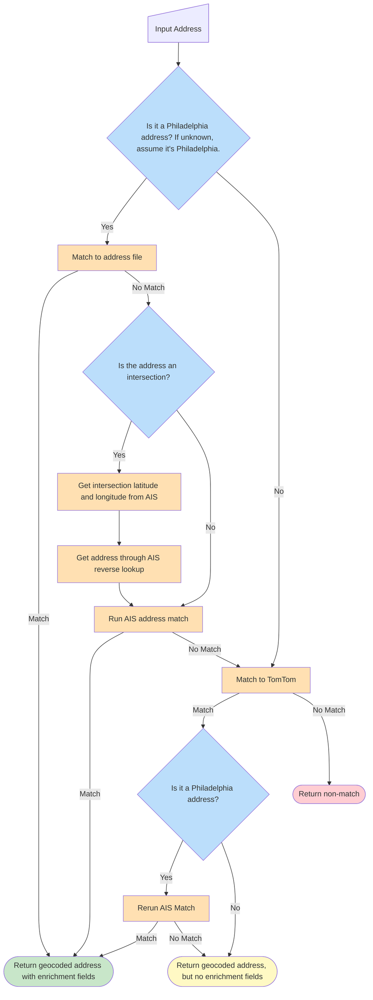

# address-geocoder
A tool to standardize and geocode Philadelphia addresses

Address Geocoder takes an input file containing addresses 
and adds latitude and longitude to those addresses, as well as any optional
fields that the user supplies.

## How The Geocoder Works

`Address-Geocoder` processes a csv file with addresses, and geolocates those addresses using the following steps:

1. Takes an input file of addresses, and standardizes those addresses using `passyunk`, Philadelphia's address standardization system.
2. Compares the standardized data to a local parquet file, `addresses.parquet`, and adds the user-specified fields as well as latitude and longitude from that file
3. Not all records will match to the address file. For those records that do not match, `Address-Batch-Geocoder` queries the Address Information System (AIS) API and adds returned fields. Please note that this process can take some time, so processing large files with a messy address field is not recommended. As an example, if you have a file that needs 1,000 rows to be sent to AIS, this will take approximately 3-4 minutes.
4. Records that don't match to the AIS API are then queried against TomTom, which has different address parsing capabilities and is also able to return
5. Records that successfully match to TomTom are then rerun against AIS to try to recover enrichment fields, if those addresses are in philly
6. The enriched file is then saved to the same directory as the input file.

The release executable of the address geocoder automatically checks an s3 bucket for an updated version of the address file. The address file is published to s3 via airflow, using this DAG configuration: https://github.com/CityOfPhiladelphia/databridge-airflow-v2-configs/blob/main/citygeo/address_service_area_summary_public.yml.

## Note:

For more information about the geocoder, consult the GitHub repository: https://github.com/CityOfPhiladelphia/address-geocoder. The README in this repo contains more details about the matching process, and information about how to run the geocoder from the command line, if desired.

## Questions?
If you have questions about the geocoder that this FAQ cannot answer, feel free to contact citygeo at: maps@phila.gov

## 1. Prerequisites
You will need the following things:
1. An executable file called `geocoder.exe`. This is used to run the program. Do not save the executable in a folder that has spaces in the name.	
2. An AIS API key, provided to you by CityGeo.


## Installation
First, you will need to download and install the geocoder.

The geocoder file can be downloaded from GitHub. The latest release can be found at: https://github.com/CityOfPhiladelphia/address-geocoder/releases/

Read through the notes carefully, and then download the zip file at the bottom of the readme.

Extract the zip folder into a folder where you can easily find it. When opening the zipped file, you may be prompted to either `extract` or `run`. Hit `extract`, not `run`, as the script will need to exist in an uncompressed directory in order to create the subfolders needed to work.

The folder **must not** have spaces in its name. The zip folder contains two files: `geocoder.exe` and `release.txt`. If you delete or rename these files, you will need to download them again or rename them back. Deleting `release.txt` will stop the program from being able to inform you if there is a new version of the `.exe` file that you need to download.

Double-clicking `geocoder.exe` will launch the program. As a first-time installation, the script will download Python and Git if not present, then download the geocoder from GitHub and install the proper dependencies. The geocoder will be downloaded to a folder called address-geocoder-main. If there are problems with your install, you may try deleting this folder and running `geocoder.exe` again.

Note that this script will attempt to install Python 3.11 on your machine if you do not have Python 3.11 installed on your machine.

The script will then attempt to download the address file. This may take a few minutes. It will save the address file and a version file in a subfolder called geocoder_address_data. Under most circumstances, you should not remove this folder or any of the files in it. Doing so will cause the script to redownload the address file.

After the installation runs successfully, you are ready to set up the configuration file.

## 2. How to Use Address Geocoder
### Three Ways to Use the Address Geocoder

There are three ways to use the address geocoder:

1. A locally-hosted web app with a **graphical user interface.**
2. Configuring a **.yml** file.
3. **Advanced:** Linux or MacOS users, running a **python command.**

### 2.1 The Graphical User Interface (GUI)

After checking for updates, `geocoder.exe` will prompt the user with two run options:
```
Choose an option:
[1] Run with the user-interface
[2] Run with the .yml config
[Any other key]: exit:
```

Press `1` to use the user interface. A window will open up in your default browser.


The user interface has the following fields.

1. The AIS API key. Required. Enter the AIS API key provided to you by CityGeo.
2. The CSV upload option. This is where you upload the file that you wish to enrich.
3. The SRIDs field: Choose which SRIDs you wish to geocode in. Required.
4. The enrichment fields: Choose which optional fields to add to your data. Optional.
5. Config file upload. If you don't want to select the same options very time (which can be tedious), you can optionally upload a pre-saved configuration file. You may additionally save the configuration you've chosen for future use, as well.

Once the required fields are entered, a geocode button will appear. You can geocode the file. Please do not close the browser while the geocoder is working, as you will be unable to download the results.

To close the geocoder, you will need to close both the browser window and the terminal window running geocoder.exe.

### 2.2 Yaml File Config

After checking for updates, `geocoder.exe` will prompt the user with two run options:

```
Choose an option:
[1] Run with the user-interface
[2] Run with the .yml config
[Any other key]: exit:
```

Press `2` to use the .yml config method. Before using this method, ensure that you have set up your configuration file. By default,
`Address Geocoder` searches for a file named `config.yml`. Detailed steps for filling out the config file are in the next section.

#### Configuration

1. The script should make a config.yml file if no config.yml file exists. If the script did not do this, you can simply copy `config_example.yml` to `config.yml` either in the file explorer by running in the terminal:
```
cp config_example.yml config.yml
```
Do not delete, rename, or move `config_example.yml`. If you delete this file, you will need to redownload it from GitHub. 
In most cases, it is not recommended to delete, rename, or move `config.yml`. If you rename this file, the geocoder will be unable to find it and will create a new config.yml.

2. Open up config.yml, and add your AIS API Key here:

```
AIS_API_KEY:
```
3. Add the filepath for the input file (the file that you wish to enrich), and the address file. The address file should have been automatically downloaded by `geocoder.exe`, and the correct path should be in the config file by default. This should look something like this. If using relative filepaths, filepaths are relative to the address-geocoder-main folder downloaded from GitHub. For ease of use, exact filepaths are recommended. Do not put the filenames in quotes:
```
input_file: ./data/example_input_4.csv
address_file: ./geocoder_address_data/address_service_area_summary.parquet
```
4. Map the address fields to the name of the fields in the csv that you wish to process. If you have one combined address field, map it to full_address_field. Otherwise, leave full_address_field blank and map column names to street, city, state, and zip. Street must be included, while the others are optional.

Example, for a csv with the following fields:
`addr_st, addr_city, addr_zip`

```
input_file: 'example.csv'

full_address_field:

address_fields:
  street: addr_st
  city: addr_city
  state:
  zip: addr_zip

```
If you have both full_address_field and the address fields filled in, the script will ask you which to use.

5. List which fields other than latitude and longitude you want to add.
  (Latitude and longitude will always be added.) If you enter an invalid field, the program will error out and ask you to try again.
  A complete list of valid fields can be found further down in this README. 

```
enrichment_fields:
  - census_tract_2020
  - census_block_group_2020
  - census_block_2020
```
6. List which SRIDs should be returned. SRID refers to the format of the coordinate system. There are two options: 4326 and 2272. 4326 is the WGS84 standard, and will be output as `geocode_lat` and `geocode_lon` and 2272 Southern Pennsylvania Projection and is output as `geocode_x` and `geocode_y`. 

```
# Which SRIDs to return for geocoding
srid_4326: true
srid_2272: true
```

The full config file should look something like this:
```
# Connection Credentials
AIS_API_KEY: YOUR_API_KEY

# File Config
input_file: ./data/example_input_4.csv
address_file: ./data/addresses.parquet

full_address_field: address

# OR, IF ADDRESS IS SPLIT INTO MULTIPLE COLUMNS:
address_fields:
  street:
  city:
  state:
  zip:

# Enrichment Fields -- Aside from coordinates, what fields to add
enrichment_fields:
  - census_tract_2020
  - census_block_group_2020
  - census_block_2020
```

7. You're now ready to run the geocoder.

Double-click `geocoder.exe` -- the same file that you used to instal geocoder.

(If you get an error about a missing package, this means something didn't install properly. Try removing the `address-geocoder-main` folder and try again.)

The dialogue will ask you to specify a config file. Hit enter without typing anything to
keep the default config file ('./config.yml')

The output file will be saved in the same location as your input file, with _enriched attached to the filename.

Note that you may see various warnings about a USPS and election file not being found, and about SSL certification. This is to be expected.

One of the steps of the enrichment process is to check against Philadelphia's address information system (AIS). Please note that this process can take some time. It takes around 3-4 minutes to make 1,000 calls to AIS. Not all records will be checked against AIS -- just those that have no match in the `addresses.parquet` file.
So, it is important to provide an input file with as clean as an address field as possible, to minimize the number of times the script checks AIS.

### 2.3 Running a Python Command

Note that this method is not currently recommended, as it requires more setup, and does not automatically check for address file updates, and requires the user to manually convert a downloaded address file to a parquet.

Navigate to the project's directory and create a virtual environment:

```
python -m venv .venv
```

Then, activate the virtual environment. This will need to be activated every time you want to run the enrichment tool, not just this once:

```
source .venv/bin/activate
```

Finally, install the packages in requirements.text:

```
pip install -r requirements.txt
```

Next, you will need to download the address file. This can be accessed via a public s3 bucket:

```
https://opendata-downloads.s3.amazonaws.com/address_service_area_summary_public.csv.gz
```

The file will need to be converted to a parquet file in order to work with the geocoder. You can do this by running the `csv_to_parquet.py` file in the repo.

```python
python csv_to_parquet.py --input_path [INPUT_PATH] --output_path [OUTPUT_PATH]
```

You will need to configure a config.yml file. You can use config_example.yml as a template. See section #2.2 for instructions on how to configure this file.

Once the file is configured, run:

```python geocoder.py```

## 3. Enrichment Fields

| `Field` |
| --- |
|`address_high`|
|`address_low_frac`|
|`address_low_suffix`|
|`address_low`|
|`bin`|
|`census_block_2010`|
|`census_block_2020`|
|`census_block_group_2010`|
|`census_block_group_2020`|
|`census_tract_2010`|
|`census_tract_2020`|
|`center_city_district`|
|`clean_philly_block_captain`|
|`commercial_corridor`|
|`council_district_2016`|
|`council_district_2024`|
|`cua_zone`|
|`dor_parcel_id`|
|`eclipse_location_id`|
|`elementary_school`|
|`engine_local`|
|`high_school`|
|`highway_district`|
|`highway_section`|
|`highway_subsection`|
|`historic_district`|
|`historic_site`|
|`historic_street`|
|`ladder_local`|
|`lane_closure`|
|`leaf_collection_area`|
|`li_address_key`|
|`li_district`|
|`major_phila_watershed`|
|`middle_school`|
|`neighborhood_advisory_committee`|
|`philly_rising_area`|
|`planning_district`|
|`police_district`|
|`police_division`|
|`police_service_area`|
|`political_division`|
|`political_ward`|
|`ppr_friends`|
|`pwd_center_city_district`|
|`pwd_maint_district`|
|`pwd_parcel_id`|
|`pwd_pressure_district`|
|`pwd_treatment_plant`|
|`pwd_water_plate`|
|`recycling_diversion_rate`|
|`rubbish_recycle_day`|
|`sanitation_area`|
|`sanitation_convenience_center`|
|`sanitation_district`|
|`seg_id`|
|`state_house_rep_2012`|
|`state_house_rep_2022`|
|`state_senate_2012`|
|`state_senate_2022`|
|`street_code`|
|`street_light_route`|
|`street_name`|
|`street_postdir`|
|`street_predir`|
|`street_suffix`|
|`traffic_district`|
|`traffic_pm_district`|
|`unit_num`|
|`unit_type`|
|`us_congressional_2012`|
|`us_congressional_2018`|
|`us_congressional_2022`|
|`zip_4`|
|`zip_code`|
|`zoning_document_ids`|
|`zoning_rco`|
|`zoning`|

# 4. Development

The following section contains information relevant to developing this project.

#### 4.1 Testing

This package uses the pytest module to conduct unit tests. Tests are located in the `tests/` folder.

In order to run all tests, for example:

```
python3 pytest tests/
```

To run tests from one file:

```
python3 pytest tests/test_parser.py
```

To run one test within a file:

```
python3 pytest tests/test_parser.py::test_parse_address
```

##### Running the end to end test

 To run the full suite of end to end tests, you will need to export an environment variable with the AIS API KEY. Otherwise, some tests will be skipped.

In mac/linux:

```
export AIS_API_KEY="<AIS_API_KEY>"
```

To do this permanently, you'll need to edit the shell configuration file.

In powershell:

```
$env:AIS_API_KEY = "<AIS_API_KEY>"
```

To do so permanently in powershell:

```
[System.Environment]::SetEnvironmentVariable("VARIABLE_NAME", "value", [System.EnvironmentVariableTarget]::User)
```

#### 4.2 Updating the Powershell Script

If you make changes to the powershell script, you may want to test how it works with the executable file. You will need to install and run Invoke-PS2EXE. Please use the following command to convert the powershell script to an exe. Do not omit the `-noConsole:$false` option, as we need that for the program to run in the console properly.

`Invoke-ps2exe -inputFile $scriptFile -outputFile $outputExe -noConsole:$false`

Do not commit the executable to the repo. Releasing the executable is handled via a github action, as described in section 4.3.

#### 4.3 Publishing a Release

This code is intended to be called using an executable file generated from `powershell/geocoder_for_exe.ps1`. If changes are made to this file, we need to make a new release.

To create a release:

1. Update the exe_version variable in the ps1 file: `$exeVersion = "v1.1.0`
2. If necessary the min_exe_version.txt in the `powershell` folder. This is the minimum version a user should be allowed to run without being forced to redownload the exe.
3. Make sure the commit is tagged with a version number like `v1.0.0`:

```
# When you're ready to create a release:
git tag v1.0.0
git push origin v1.0.0
```

Publishing a new release will trigger the `build-and-publish` workflow, which calls the following command to create an executable file from the powershell script: `Invoke-ps2exe -inputFile $scriptFile -outputFile $outputExe -noConsole:$false`

## 5. Matching Process


```mermaid
flowchart TB
    A["Input Address"] --> B@{ label: "Is it a Philadelphia address? If unknown, assume it's Philadelphia." }
    B -- Yes --> C["Match to address file"]
    B -- No --> D["Match to TomTom"]
    C -- Match --> E["Return geocoded address with enrichment fields"]
    C -- No Match --> F["Is the address an intersection?"]
    D -- Match --> G["Is it a Philadelphia address?"]
    D -- No Match --> H["Return non-match"]
    F -- Yes --> I["Get intersection latitude and longitude from AIS"]
    F -- No --> J["Run AIS address match"]
    I --> K["Get address through AIS reverse lookup"]
    J -- Match --> E
    J -- No Match --> D
    K --> J
    G -- Yes --> M["Rerun AIS Match"]
    G -- No --> N["Return geocoded address, but no enrichment fields"]
    M -- Match --> E
    M -- No Match --> N
    A@{ shape: manual-input}
    B@{ shape: decision}
    C@{ shape: process}
    D@{ shape: process}
    E@{ shape: terminal}
    F@{ shape: decision}
    G@{ shape: decision}
    H@{ shape: terminal}
    I@{ shape: process}
    J@{ shape: process}
    K@{ shape: process}
    M@{ shape: process}
    N@{ shape: terminal}
    style B fill:#BBDEFB
    style C fill:#FFE0B2
    style D fill:#FFE0B2
    style E fill:#C8E6C9
    style F fill:#BBDEFB
    style G fill:#BBDEFB
    style H fill:#FFCDD2
    style I fill:#FFE0B2
    style J fill:#FFE0B2
    style K fill:#FFE0B2
    style M fill:#FFE0B2
    style N fill:#FFF9C4

```