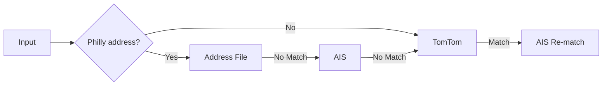

# The Matching Process

## The Matching Pipeline

## Match Types

- :lucide-circle-check: **Address File Match**

    Matched against the address file directly.

    Returns coordinates + all requested enrichment fields.

- :lucide-circle-check: **Full AIS Match**

    Matched against AIS directly.

    Returns coordinates + all requested enrichment fields.

- :lucide-circle-alert: **AIS Intersection Match**

    Matched to an intersection in AIS.

    Returns coordinates + a partial list of enrichment fields.

- :lucide-circle-alert: **AIS Service Area Match**

    Failed to match to an exact maddress in AIS, but matched to a service area via a coordinate lookup.

    Returns coordinates + a partial list of enrichment fields.

- :lucide-circle-alert: **TomTom Match**

    Matched to TomTom, but failed to match to AIS. 

    Returns coordinates, but no enrichment fields.

- :lucide-circle-x: **No Match** 

    Failed to match to the address file, AIS, or TomTom.

    Returns nothing.

