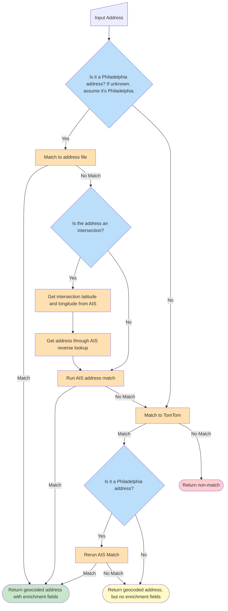

# The Matching Process

```mermaid
flowchart TB
    A["Input Address"] --> B@{ label: "Is it a Philadelphia address? If unknown, assume it's Philadelphia." }
    B -- Yes --> C["Match to address file"]
    B -- No --> D["Match to TomTom"]
    C -- Match --> E["Return geocoded address with enrichment fields"]
    C -- No Match --> F["Is the address an intersection?"]
    D -- Match --> G["Is it a Philadelphia address?"]
    D -- No Match --> H["Return non-match"]
    F -- Yes --> I["Get intersection latitude and longitude from AIS"]
    F -- No --> J["Run AIS address match"]
    I --> K["Get address through AIS reverse lookup"]
    J -- Match --> E
    J -- No Match --> D
    K --> J
    G -- Yes --> M["Rerun AIS Match"]
    G -- No --> N["Return geocoded address, but no enrichment fields"]
    M -- Match --> E
    M -- No Match --> N
    A@{ shape: manual-input}
    B@{ shape: decision}
    C@{ shape: process}
    D@{ shape: process}
    E@{ shape: terminal}
    F@{ shape: decision}
    G@{ shape: decision}
    H@{ shape: terminal}
    I@{ shape: process}
    J@{ shape: process}
    K@{ shape: process}
    M@{ shape: process}
    N@{ shape: terminal}
    style B fill:#BBDEFB
    style C fill:#FFE0B2
    style D fill:#FFE0B2
    style E fill:#C8E6C9
    style F fill:#BBDEFB
    style G fill:#BBDEFB
    style H fill:#FFCDD2
    style I fill:#FFE0B2
    style J fill:#FFE0B2
    style K fill:#FFE0B2
    style M fill:#FFE0B2
    style N fill:#FFF9C4
```
